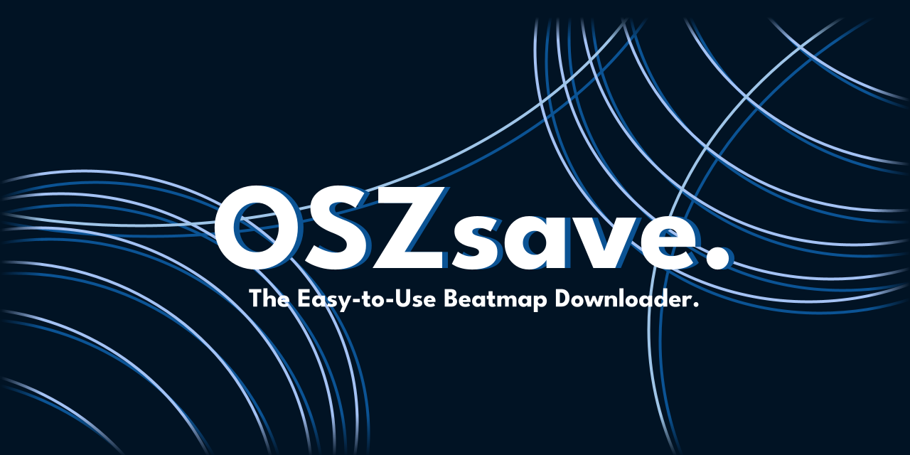

    
# OSZsave - osu! Beatmap Downloader
### Version 1.3.0

             
[![Button Icon]][Link]

[Button Icon]: https://img.shields.io/badge/Installation-0b5394?style=for-the-badge&logoColor=white&logo=DocuSign

[Link]: https://github.com/ForgedCore8/OSZsave/releases/latest/download/oszsave.exe

  

   
## About

OSZsave is a powerful and convenient tool designed to help osu! players download their favorite beatmaps in bulk. Whether you want to import a handful or hundreds of beatmaps from user profiles, OSZsave streamlines the process, saving you time and effort.

### Features
- **Bulk Download**: Easily download multiple beatmaps at once from your chosen user profile.
- **Custom Headers**: Personalize your download process by adding custom headers.
- **Ease of Use**: Simple step-by-step instructions guide you through the setup and download process.
- **Lightweight**: OSZsave is designed to be user-friendly, lightweight, and efficient, making it accessible to players of all skill levels.
- **Anti Ratelimit**: Avoiding the rate limit to download as many beatmaps as possible.
- **Wide Range**: Unlike other tools, this program allows you to get every beatmap from a user's profile.
- **Storage Efficient**: This tool ensures that it is only downloading new maps, saving you space and time.

### Why OSZsave?
osu! is a fast-paced rhythm game with a vibrant community that continually creates new beatmaps. OSZsave provides a way to quickly and easily download these beatmaps, whether you're looking to experiment with new challenges or simply expand your collection. With its emphasis on user-friendliness and efficiency, OSZsave is a must-have tool for osu! enthusiasts.

    
# Instructions:

## Getting Headers:

1. Navigate to the [osu.ppy.sh](https://osu.ppy.sh) website.
2. Go to the beatmaps page.
3. Select a random beatmap.
4. Open the network page. This can be achieved by pressing `F12` or right-clicking the page and selecting 'Inspect'. Once the inspection window is open, navigate to the 'Network' tab.
5. Click the download button on the beatmap. Note that you do not have to save it; just clicking it is enough.
6. In the network tab, find the packet that is titled "download."
7. Right-click this packet and choose 'Copy as cURL (bash).'
8. Paste the copied command into the `curl_command.txt` file.

## Getting Beatmap Links:

1. When you run the program, it will ask you to input the user profile link.
2. Input the link and the program will generate the beatmap links for you.

## Running:

1. After the headers and beatmap links are ready, you can run the program.
2. Once all of the beatmaps have finished downloading, the program will automatically move the files to the osu! songs folder.
3. Enjoy the maps!

### Notes:
- Please be aware that the program could take up to several hours to complete if you are processing a large list of beatmaps. Make sure to plan accordingly and be patient.
- If osu! doesn't automatically process the new beatmaps, press `F5` in the song select screen to manually refresh the song list.

---

## Need Help?
- If you encounter any problems or have any questions about the process, feel free to reach out to me on Discord: @forgedcore8. I'll be happy to assist you!
- Alternatively, you can also go to the project's [issue tracker](https://github.com/ForgedCore8/OSZsave/issues)

